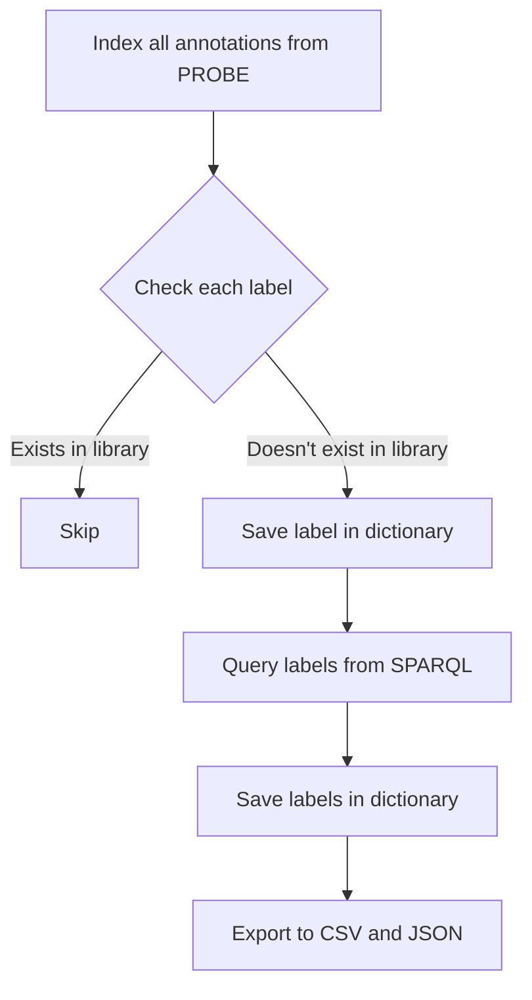
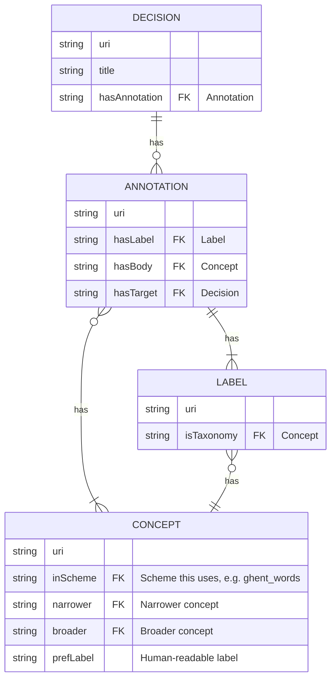

# Label Export

This tool attempts to read all annotations of the decisions in [PROBE](https://probe.stad.gent/sparql) and queries the human readable labels for them. These are then exported to a CSV file and a JSON file.

## Data

A rough structure of how the labels are organized in SPARQL, while this is not the exact structure, it gives a good idea of how the data is organized, and how it can be queried.

## Automation

This tool is run automatically every sunday at 03:00 AM. The tool will then query all annotations and labels from PROBE and export them to a CSV and JSON file, and push them to the repository.
